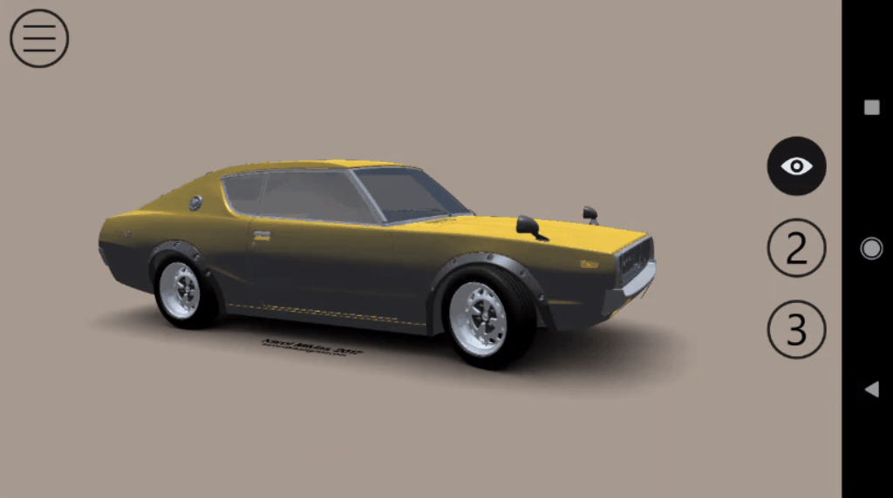

# Xamarin.Forms Sample using Wave Engine

Xamarin.Forms  application that makes use Wave Engine, cross platform game engine, to demonstrate the possibilities of mix 3D content with nice XAML UIs.

## Screens

 
## Licenses

This project uses some third-party assets with a license that requires attribution:

- karolmiklas: 3D model creator in [Sketchfab](https://sketchfab.com/karolmiklas).

## Copyright and license

Code released under the [MIT license](https://opensource.org/licenses/MIT).